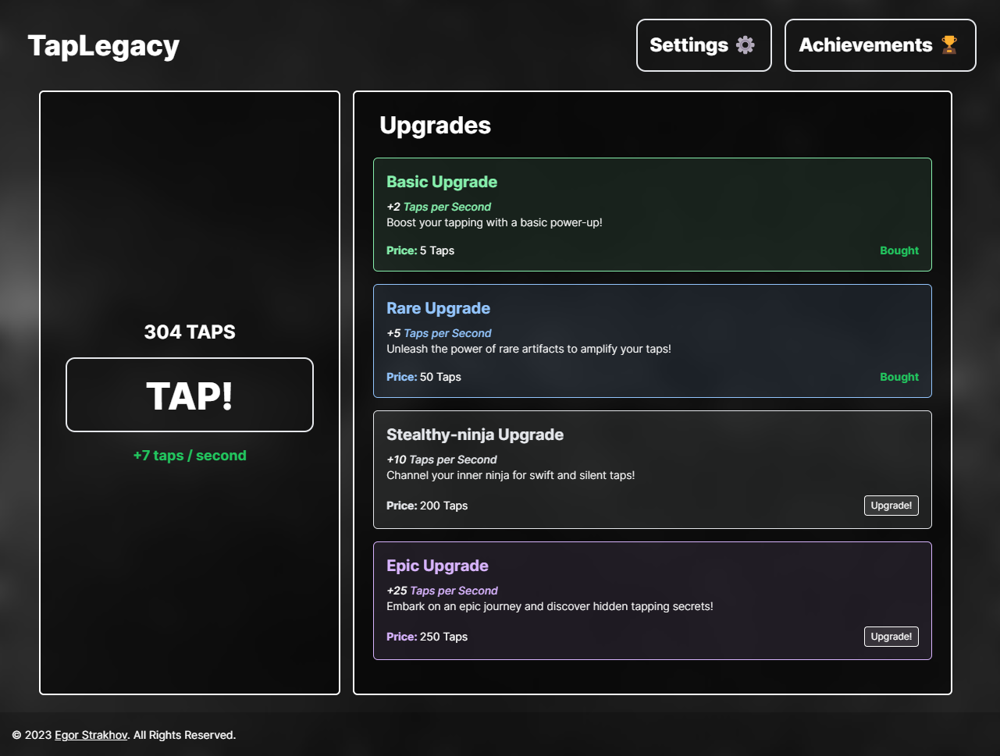

# TapLegacy - An Idle Clicking Game
## Start Your Tapping Adventure 🚀
Welcome to TapLegacy, a cool web game where you kick off your tapping journey with a simple click. Explore the world of upgrades, gather taps, and aim for achievements.



## Making the Game 🎩✨

### Tech Stuff

Here's what makes the magic happen:
- **HTML** and **CSS**: Creating the awesome visuals.
- **JavaScript**: Making things happen behind the scenes.
- **React**: Adding life to the game with dynamic features.
- **React Router v6**: Creating smooth paths for your tapping journey.
- **Tailwind CSS**: Adding a touch of style to everything.
- **Vite**: Making development quick and enchanting.

## Start Tapping! 💥

### Cool Features

#### Awesome Design 🌌
- A cool design that draws you into the tapping world.
- Works smoothly on big screens and tiny smartphones.

#### Magical Data Handling 📊
- `localStorage`, a safe place to store your data.
- Components that make the game seamless and fun.

#### Heart of the Game ❤️🎮
- The **Button of Power**: Your entry to the tapping adventure!
- Watch your **Taps** (currency) grow and feel the excitement of taps per second.
- An **Upgrades List** with powerful elixirs – each one getting you closer to tapping domination.

### Fun Routes 🛤️
- Move through the realms easily with React Router's cool routes.
- A portal to the **Achievement List**, where your triumphs are celebrated with rewards.
- Check your stats and remove data in the **Settings** route.

## Live Deployment 🚀

Check out the live deployment of TapLegacy: [TapLegacy](https://taplegacy.netlify.app/)

## How to Play 📜

### Get Started on Your Tapping Quest


1. **Clone the Game**
   ```bash
   git clone https://github.com/Sillor/taplegacy.git
   ```
2. **Install Dependencies**
    ```bash
    cd taplegacy
    npm install
    ```
3. **Start the Game**
    ```bash
    npm run dev
    ```